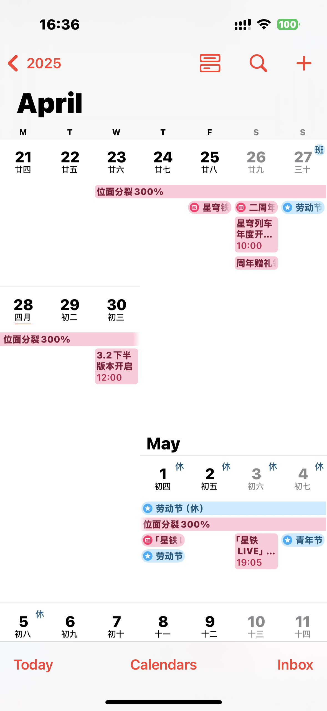
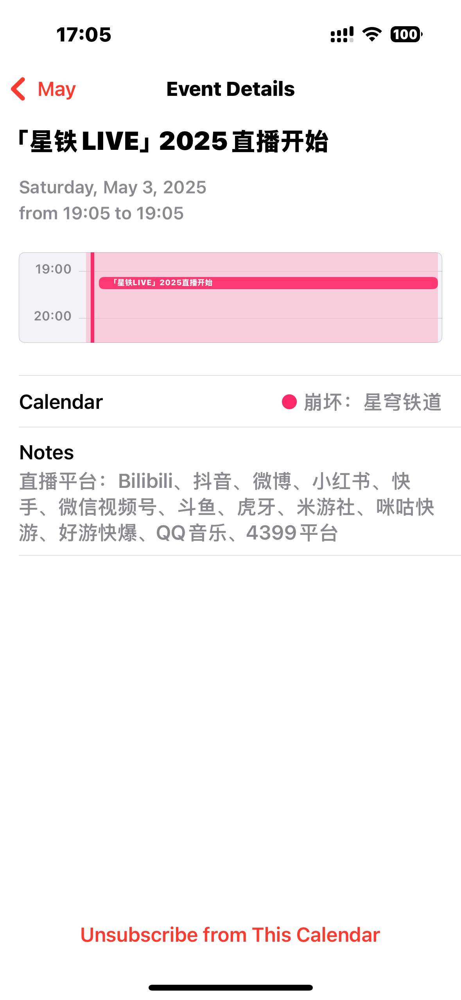
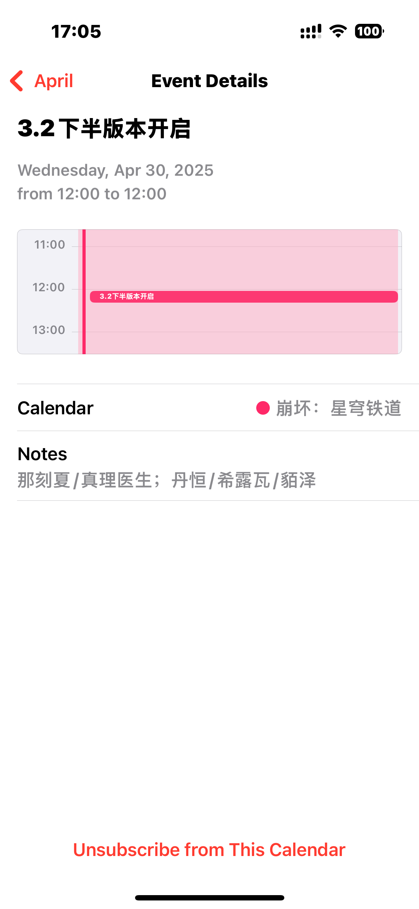
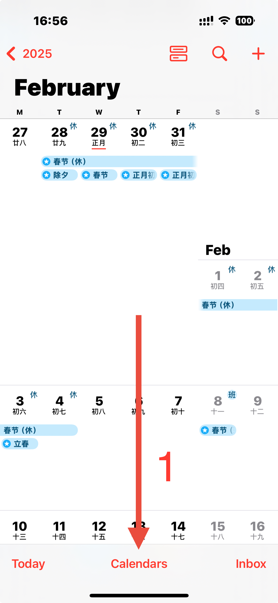
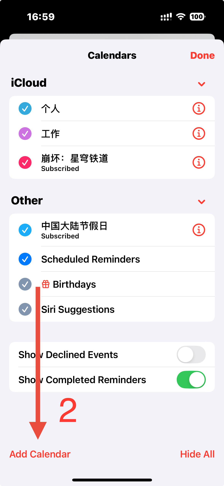
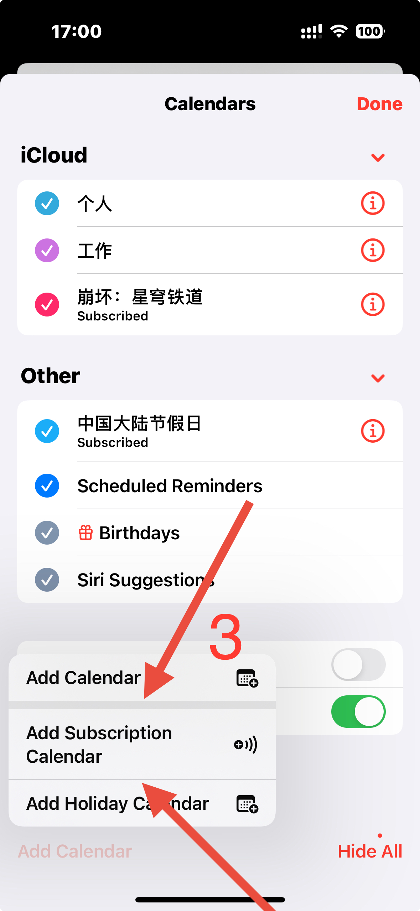
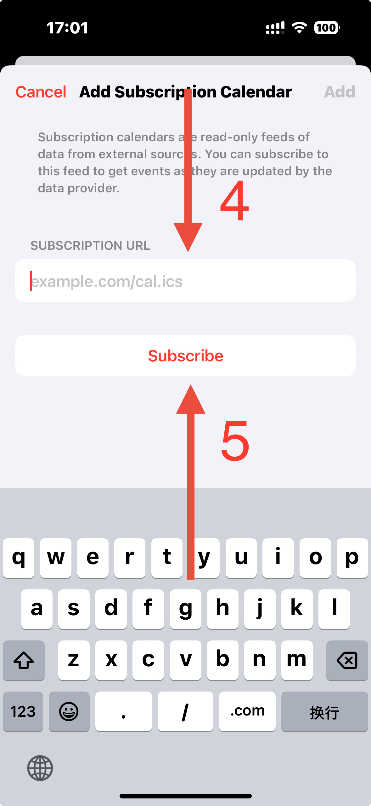

# StarRail Calendar

> “ 能和我玩一辈子星铁吗 (＠Д＠;) ”

提供 `.ics` 日历订阅文件，记录游戏《崩坏：星穹铁道》的事件，同步更新。

更新不及时或信息有误，欢迎随时发邮件~~骚扰~~提醒我 waitwill@icloud.com (/≧▽≦)/

## 效果展示

<table>
    <tr>
        <td>🤪</td>
        <td></td>
        <td></td>
        <td></td>
        <td>😍</td>
    </tr>
</table>

## 当前日历数据透视

- [https://willsat.github.io/starrail_calendar/](https://willsat.github.io/starrail_calendar/)  

- [https://willsat.github.io/starrail_calendar/full.json](https://willsat.github.io/starrail_calendar/full.json) 

## 食用方法（以 iOS 日历举例，其他平台同理）

> 订阅地址：Github Pages：https://willsat.github.io/starrail_calendar/full.ics  
> 订阅地址：Github Raw：https://github.com/WillSat/starrail_calendar/raw/refs/heads/main/full.ics

<table>
    <tr>
        <td></td>
        <td></td>
        <td></td>
        <td></td>
    </tr>
</table>

> 针对中国大陆的网络情况，推荐使用反向代理。可用性自行测试喵～
> - https://gh.scy.ink/https://github.com/WillSat/starrail_calendar/raw/refs/heads/main/full.ics
> - https://gh.qninq.cn/https://github.com/WillSat/starrail_calendar/raw/refs/heads/main/full.ics
> - https://hub.gitmirror.com/https://github.com/WillSat/starrail_calendar/raw/refs/heads/main/full.ics
> - https://ghproxy.monkeyray.net/https://github.com/WillSat/starrail_calendar/raw/refs/heads/main/full.ics
> - https://gh.b52m.cn/https://github.com/WillSat/starrail_calendar/raw/refs/heads/main/full.ics
